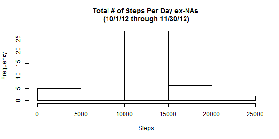
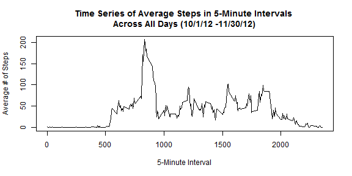
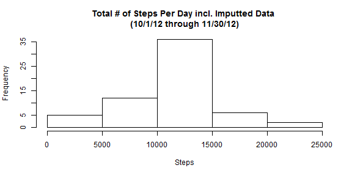
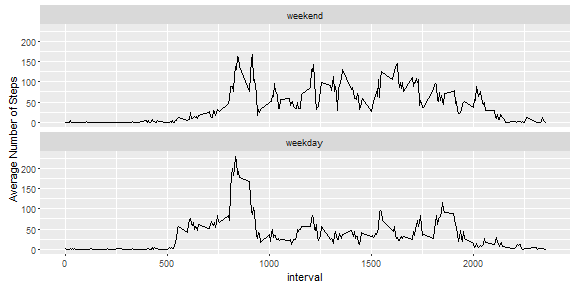

# Reproducible Research - Peer Assessment 1
==================================================================================================================

This report addresses four general questions related to a large collection of data gathered in a study about personal movement using activity monitoring devices such as a Fitbit, Nike Fuelband, or Jawbone Up. The objective of the study is to improve health by finding patterns in personal health and fitness behavior. The assignment makes use of data from a personal activity monitoring device. This device collects data at 5 minute intervals through out the day. The data consists of two months of data from an anonymous individual collected during the months of October and November, 2012 and include the number of steps taken in 5 minute intervals each day.

## Data

The data for this assignment was downloaded from the web site:

Dataset: [Activity monitoring data] https://d396qusza40orc.cloudfront.net/repdata%2Fdata%2Factivity.zip [52K]
The variables included in this dataset are:

steps: Number of steps taking in a 5-minute interval (missing values are coded as NA)
date: The date on which the measurement was taken in YYYY-MM-DD format
interval: Identifier for the 5-minute interval in which measurement was taken

The dataset is stored in a comma-separated-value (CSV) file and there are a total of 17,568 observations in this dataset.

## Assignment Questions

### *What is mean total number of steps taken per day?*

The objective for this part of the assignment is to construct a histogram of the total number of steps taken each day. Note that for this section I will ignore the missing values in the dataset. I am also tasked to calculate and report the mean and median total number of steps taken per day

### *What is the average daily activity pattern?*

To examine this question I must make a time series plot (i.e. type = "l") of the 5-minute interval (x-axis) and the average number of steps taken, averaged across all days (y-axis). I am also tasked to determine which 5-minute interval, on average across all the days in the dataset, contains the maximum number of steps?

### *Imputing missing values*

As there are a number of days/intervals where there are missing values (coded as NA), the presence of missing days may introduce bias into some calculations or summaries of the data. To examine the impact of missing values I am tasked to calculate and report the total number of missing values in the dataset (i.e. the total number of rows with NAs). Also, I am asked to devise a simple/naive strategy for filling in all of the missing values in the dataset. Examples of such a strategy are using the mean/median for that day to fill in the missing value, or using the mean of the specific 5-minute interval.

Once the missing values have been filled, I am to use the new complete dataset to create a new dataset that is equal to the original dataset but with the missing data completed. I then must construct a histogram of the total number of steps taken each day and Calculate and report the mean and median total number of steps taken per day (as I did for the first question for the incomplete dataset). 

This done I am to examine the results to determine if they differ from those obtained from the incomplete dataset from the first part of the assignment. How did the inclusion of the missing data affect the estimates of the total daily number of steps?

### *Are there differences in activity patterns between weekdays and weekends?*

For this part of the analysis I am to use the newly created dataset with the filled-in missing values. Furthermore, I am to create a new factor variable in the dataset with two levels -- "weekday" and "weekend" indicating whether a given date is a weekday or weekend day. This is turn is to be used to make a panel plot containing a time series plot (i.e. type = "l") of the 5-minute interval (x-axis) and the **average number of steps taken, averaged across all weekday days or weekend days (y-axis)**. 

## Results

I initialized the systems with the following script in order to read in the acitivity files and summon the required libraries. Recall that the activity file was provided by the instructor so I hae no information on the source of the information.


```r
setwd("C:/Users/Derek/Desktop/datasciencecoursera/data")

# Required Libraries
library("knitr")
library("dplyr")
library("lubridate")
library("ggplot2")
act<-read.csv("activity.csv")
```

The following code was used to address the **first set of questions** (e.g., What is mean total number of steps taken per day?) I used the variable names **"paces"** to avoid confusion with the file variable column name "steps".


```r
#Question #1
paces<-tbl_df(na.omit(act))
paces<-select(act, steps, date)%>%group_by(date)%>%summarize(steps=sum(steps))
hist(paces$steps, main= "Total # of Steps Per Day ex-NAs \n(10/1/12 through 11/30/12)", 
     xlab="Steps", col="white")
```

 

```r
paces<-tapply(paces$steps,paces$date,sum)
mean(paces, na.rm=TRUE)
```

```
## [1] 10766.19
```

```r
median(paces, na.rm=TRUE)
```

```
## [1] 10765
```

The following code was used to address **the second set of questions** (e.g., What is the average daily activity pattern?) In the code the variable **"apaces"** represents the average number of steps taken in the 5-minute intervals across all the days. The variable **"max_interval"** is the variable that gets assigned the value associated with the maximum number of steps over a given 5-minute interval, on average across all the days in the dataset.


```r
#Question #2
apaces<-select(act, steps, date, interval)%>%group_by(interval)%>%summarize(steps=mean(steps,na.rm=TRUE))
plot(x=apaces$interval,y=apaces$steps,type="l", xlab="5-Minute Interval", ylab="Average # of Steps", 
     main="Time Series of Average Steps in 5-Minute Intervals \nAcross All Days (10/1/12 -11/30/12)")
```

 

```r
max_interval<-apaces[which.max(apaces$steps),1]
max_interval
```

```
## Source: local data frame [1 x 1]
## 
##   interval
##      (int)
## 1      835
```

The following code was used to address **the third set of questions**, which related to the effect of creating a dataset where the missing values from question #1 were filled. The first chunk computes and reports the number of missing values.


```r
# Question #3
# Calculate and report the number of missing values (e.g., NAs)
no_value<-which(is.na(act$step))
length(no_value)
```

```
## [1] 2304
```

The next section of the code completes the dataset using the mean for the specific 5-minute interval.


```r
# Question #3
# Complete the dataset by inserting the mean for the specific 5-minute interval
mfile<-subset(act,is.na(steps),select=c("steps","date","interval"))
minterval<-select(act, steps, date, interval)%>%group_by(interval)%>%summarize(steps=mean(steps,na.rm=TRUE))
missing<-merge(mfile,minterval, by="interval")
good_file<-subset(act,!is.na(steps),select=c("steps","date","interval"))
missing<-select(missing, -steps.x)
colnames(missing)<-c("interval","date","steps")
missing<-select(missing,steps,date,interval)
```

The next section creates the new complete dataset.


```r
# Question #3
# This is the new data Set
new_file<-rbind(missing,good_file)
```

The following section constructs the histogram for the completed data set.


```r
# Question #3
# This section constructs the histogram with the completed new dataset
n_file<-select(new_file, steps, date)%>%group_by(date)%>%summarize(steps=sum(steps,na.rm=TRUE))
hist(n_file$steps, main= "Total # of Steps Per Day incl. Imputted Data \n(10/1/12 through 11/30/12)", 
     xlab="Steps", col="white")
```

 

The final chunk computes and reports the mean and median of the new complete dataset 


```r
# Question #3
# This section computes and report the mean and median with using the new dataset
n_file<-tapply(n_file$steps,n_file$date,sum)
mean(n_file,na.rm=TRUE)
```

```
## [1] 10766.19
```

```r
median(n_file,na.rm=TRUE)
```

```
## [1] 10766.19
```

**Note that the histogram for the completed data differs from the histogram in the amplitude of the data, but no much with respect to the mean and median. This was to be expected since I used the mean of the 5-minute interval from the incomplete set. Therefore the mean would not change. The median saw a slight shift due to the additional data points, which shifted the center of the distribution very slightly. Overall the total number of steps increased, but this was offset by the increase in the total number of observation, which increased from 53 to 61.**

The final question ask, "Are there differences in activity patterns between weekdays and weekends?" The first of the task is to create a new factor variable. The following chunk performs this task.


```r
# Question #4
# Create weekend, weekday factor
new_file$date <-wday(new_file$date, label=TRUE)
wdays<-c("Mon","Tues","Wed","Thurs","Fri")
business<-new_file$date%in%wdays
new_file<-cbind(new_file,business)
new_file$business<-as.factor(new_file$business)
levels(new_file$business)<-list(weekend="FALSE", weekday="TRUE")
```

The following chunk computes the average number of steps taken over the 5-minute interval across the days and constructs a panel plot containing a time series plot.


```r
# Question # 4
# Compute average number of steps taken over the 5-minute interval across the days
# and constructs a panel plot containing a time series plot.
activity<-select(new_file, steps, date, business, interval)%>%group_by(interval,business)%>%summarize(steps=mean(steps,na.rm=TRUE))
ggplot(activity, aes(x=interval,y=steps))+geom_line()+facet_wrap(~business,nrow=2)+ylab("Average Number of Steps")
```

 


